# Blue Ocean travel e-commerce store

Blue Ocean travel is an online e-commerce store that specialises in booking trips on the Australian East Coast. Users will be able to book single or multiple trips and also have the option to contact the company to have a personalised itinerary created. The users will have the possibility to make an account, add tours to their shopping cart, book tours, and process payment through the site. This site  was developed using Python (Django), HTML, CSS and by storing the data in a PostgreSQL database.

<!-- Add live link -->
[Live Website](https://blue-ocean-travel-feb523e57a47.herokuapp.com/)

<!-- Add responsive mockup -->
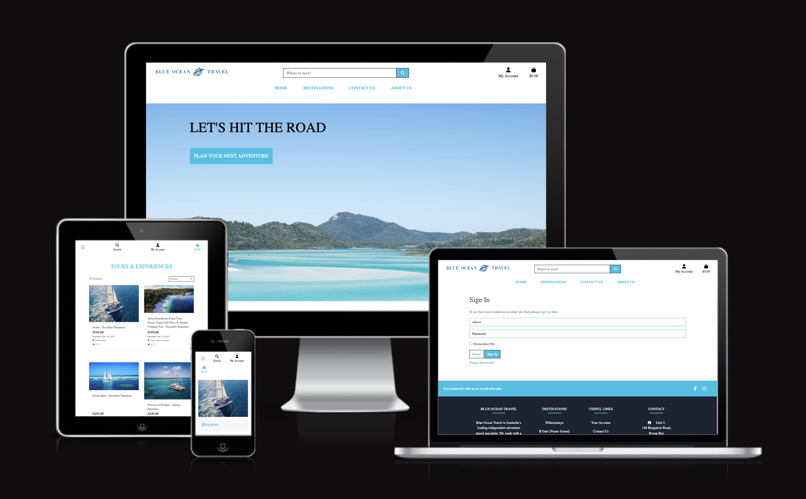

## User Goals and Stories

### User goals
- As a user I want to
  - easily and intuitively navigate throughout the website
  - browse the website naturally and with ease
  - be able to view the website and read all information on all screen sizes
  - Create an account on the website
  - View different tour options
  - See the differences between different tours
  - Book tours through the website
  - Process payment through the website
  - have my tickets emailed to me once I have completed the transaction
  - view my itinerary once I have completed the transaction	
  - Contact the company directly
  - Learn more about the company and see if they suit my needs
  - sign up for a company mailing list
  - leave reviews on the different tours I've done

### Business owner goals
- As the website business owner I want to 
  - Provide users information about the tours on offer
  - Allow users to easily access and use the site.
  - Allow users to view tours.
  - Allow users to book tours.
  - Allow users to pay for tours directly through the site.
  - Allow users to view their itinerary.
  - Collect user information
  - Provide contact information to users
  - have users contact the business to create a personalised itinerary
  - collect users emails to add them to a mailing list

### User Stories

#### As a user
  - As a user I want to visit the website and understand it’s purpose immeditately
  - As a user I want to easily understand how to use the website
  - As a user I want to be able to contact the business owner
  - As a user I want to create an account easily
  - As a user I want to input my information with ease
  - As a user I want to create a booking with ease
  - As a user I want the ability to view my itinerary
  - As a user I want the ability to create multiple tour bookings
  - As a user I want to have an enjoyable experience
  - As a user I want to learn about the company I'm doing business with
  - As a user I want to join a company mailing list
  - As a user I want to leave reviews for different tours I've done
  - As a user I want to return to the site to create another booking
  - As a user I want to contact the business to have them create an itinerary for me

#### As a website business owner
  - As a site owner I want to excite users and peak their interest
  - As a site owner I want to allow for a good user experience
  - As a site owner I want to allow the user to easily navigate the website without issues
  - As a site owner I want to encourage users to create an account
  - As a site owner I want to encourage users to create tour bookings
  - As a site owner I want to encourage users to contact us directly to create a personalised itinerary
  - As a site owner I want to convert as many users into customers as possible
  - As a site owner I want to ensure the payment process is as seemless as possible
  - As a site owner I want to collect user information
  - As a site owner I want to have users sign up for a mailing list
  - As a site owner I want to have staff add new tours without accessing the backend
  - As a site owner I want to have staff view contact us information without accessing the backend

#### As a new user
  - As a new user I want to navigate the page intuitively and with ease
  - As a new user I want to understand the page purpose upon first viewing
  - As a new user I want to see company contact information
  - As a new user I want to be able to contact the company directly
  - As a new user I want to see the company’s social media presence
  - As a new user I want to easily create an account
  - As a new user I want to easily book tours
  - As a new user I want to contact the company to create a personalised itinerary
  - As a new user I want to enjoy the experience and return to make another booking

## Design

### Font
I used the Lato and Poppins fonts from GoogleFonts. I opted for these fonts as they are clean, easy to read and versatile which make them perfect for a youth adventure travel website. I opted to use Poppins font for the headings and Lato for the body. The only exception to this was the homepage hero image where I opted to use the Lato text as I felt this looked betted

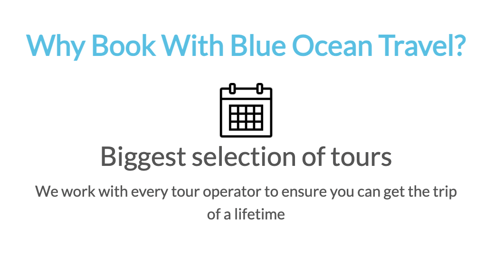

### Colour

The colour scheme is a simple blue that reminds the user of the ocean and instills a desire to travel. The white background contrasts with the light blue font to create an easy yet eye catching colour palette. This colour scheme was inspired by Whitehaven beach which is renowned for it's crystal clear aquatic blue water and powdery white sands. The colour scheme fits well with the company name and the company ethos of inspiring it's users to travel. The blue colour scheme was also inspired by [BareFootCampers](https://www.barefootcampers.nz/) in New Zealand. 

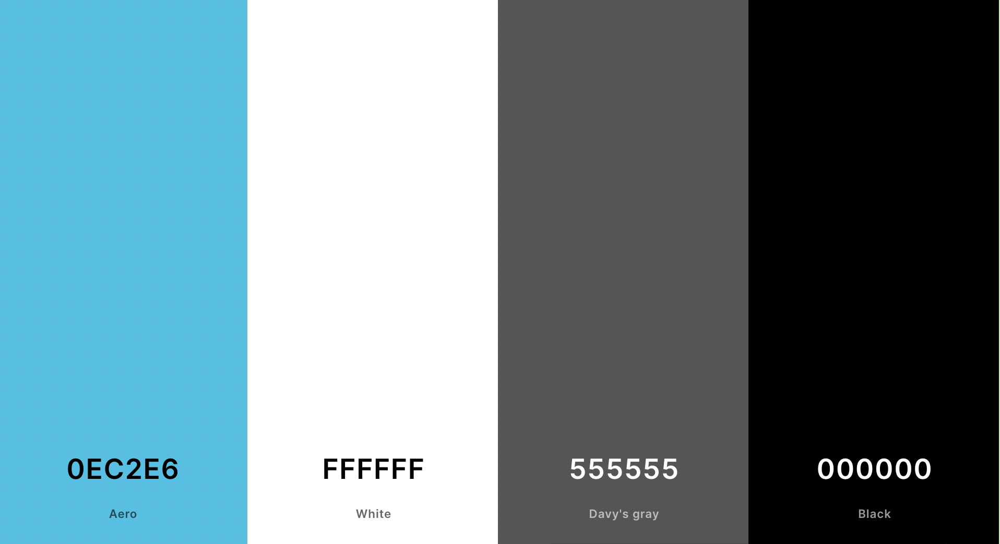

### Logo

The logo is an artificially generated logo from [Looka](www.looka.com)
The logo contains the company name and is designed to inspire users to travel and make the leap to travel the world. This is done to encourage users to visit Australia and book tours via the website.

### Wireframes

  
See wireframes

  - Homepage
  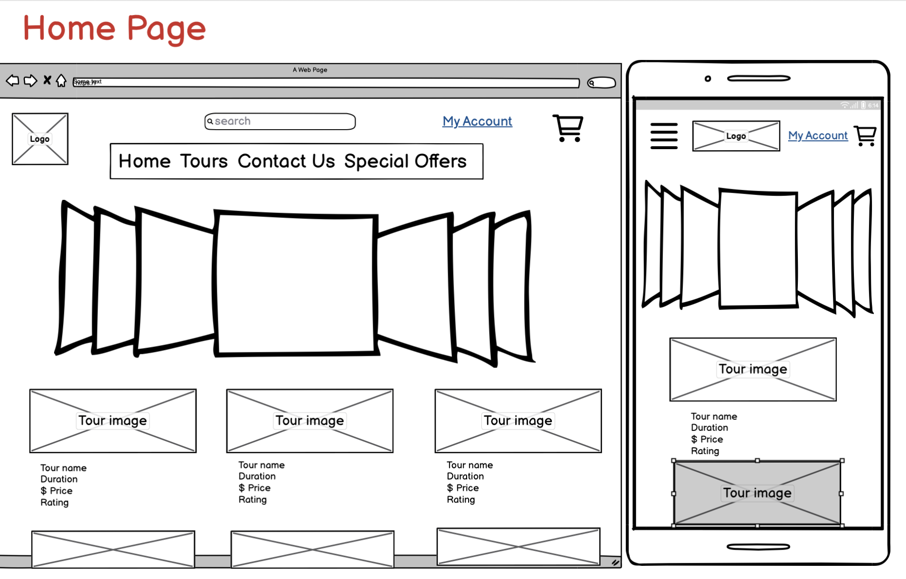

  - Contact Us
  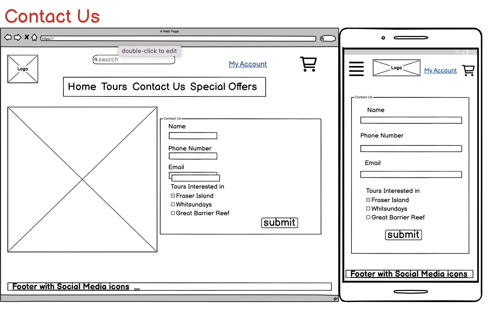
  
  - Product page
  

  - Product Booking Page
  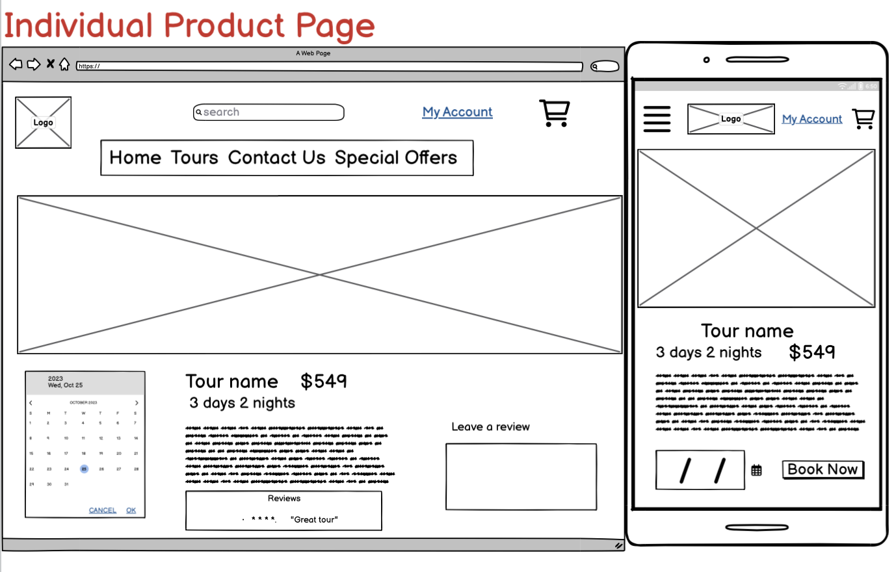

### Entity relationship diagram

This diagram shows how the users and staff users interact with the database.

## Development

### Agile Methodology

This project was developed using the Agile methodology. All epics and user stories implementation progress was tracked through Github projects Kanban Board which can be found [here](https://github.com/users/d-lynch95/projects/4/views/1).

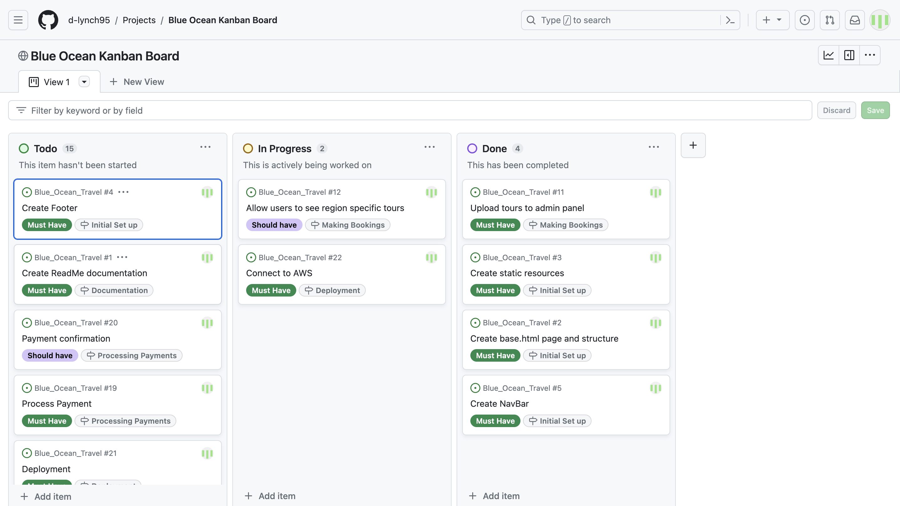

This project had 6 main epics (Milestones)

I. Epic 1. Initial Set up
  - As a developer, I need to create the base.html page and structure so that other pages can reuse the layout
  - As a developer, I need to create static resources so that images, css and javascript work on the website
  - As a developer, I need to set up the project so that it is ready for implementing the core features
  - As a developer, I need to create the footer with social media links and contact information
  - As a developer, I need to create the navbar so that users can navigate the website from any device

II. Epic 2.  USER REGISTRATION/AUTENTHICATION
  - As a developer, I need to implement the Register page using the django-allauth module
  - As a developer, I need to implement the Login page using django-allauth module
  - As a developer, I need to implement the  Logout modal using django-allauth module
  - As a site owner, I would like the allauth pages customized to that they fit in with the sites styling
  - As a site owner, I would like staff to be able to add tours without accessing the admin panel
  - As a user, I would like to be able to log in using social media or a google account
    

III. Epic 3 - Making bookings
  - As a user, I would like to be able to view all available tours
  - As a user, I would like to be able to view which tours are available for certain regions
  - As a user, I would like to be able to create a new booking
  - As a user, I would like to view my previous bookings when I need to check the information
  - As a user, I would like to be able to edit a booking so that I can make changes when needed
  - As a user I would like to delete a booking when I no longer require it
  - As a user I would like to be able to contact the company if I had any questions
  - As a user I would like to be able to add items to my wishlist
 
IV. Epic 4 - Processing Payment
  - As a user, I would like to view my bookings before completing payment
  - As a user, I would like to process payment easily and efficiently
  - As a user, I would like to receive an email confirming my purchase and payment confirmation

V. Epic 5 - Deployment Epic  
  - As a developer, I need to deploy the project to heroku so that it is live for users
	
VI. Epic 6 - Documentation
  - Complete readme documentation

My sprints were planned out as follows:
-   Sprint #1 - 23/10  - 29/10
    - In the first milestone my main goal was to get the project's framework set up and running and do an early deployment. I also added Login/Registration functionality using django-allauth. Most of this sprint was about setting up the backend and the tasks were labeled as Dev Task (DT). The following tasks were a part of this sprint:
        - DT Install of Django Environment
        - DT Create Django Project
        - DT Set Up Heroku
        - DT Deployment
        - DT Set Up Django allauth
        - DT Create an admin panel
        - DT Create Database models from ERD

-  Sprint #2 30/10 - 05/11
    - Create models, general site structure and navigation elements (navbar and footer) based on the original wireframes. In this sprint I moved from the backend to setting up the basic frontend features of the app and to user stories (US).
        - US Homepage Setup
        - US Navigation
        - US Contact Page
        - US Footer
        - US Sign Up
        - US Log In
        - US Log Out
        - US Create User Profile
        - DT Install Django Crispy Forms

- Sprint #3 - 06/11 - 12/11 
    - Upload different tours and their descriptions to the website. Allow users to see more detailed descriptions of the tours. Allow users to add products to their baskets.
        - US View different products
        - US View region specific products
        - US Contact company
        - US Basic Search Functionality
        - US Add products to basket
        - DT Readme Forking/Cloning

- Sprint #4 - 13/11 -19/11
  -  Add hero images and messages
        - US Add hero image
        - US Display messages upon user action
        - DT Write up all the bugs until now
        - US Allow users to leave reviews and ratings on different tours
        

- Sprint #5 - 20/11 - 26/11
    - Add stripe payment processing to webpage
      - US Process Payment
      - US Improve website's style
      - US Email validation to confirm purchase
      - 

-  Final Sprint
    - Perform manual testing of HTML, CSS, Python, JS, LightHouse, responsivness, browser compatibility, user story testing. Add custom error pages. Add input validation. Make minor improvements and fix bugs. 
        - DT Readme Deployment
        - DT Add customized 403, 404 and 500 error pages
        - US Add validators for user inputs
        - DT Readme: Technologies and packages used, Testing, ERD, Credits, Error Pages sections
        - DT Do thorough testing of all aspects of the application to make sure everything works seamlessly and write up the documentation

## Technologies used
- Python
  - The main language used in this project was python
- HTML
  - The website contains HTML
- CSS
  - The styling is done using CSS
- GitHub
  - The website is hosted on GitHub
- GitPod
  - The website was developed on GitPod
- Git
  - used to commit and push code during development
- Heroku
  - The website is hosted on heroku
- Convertio.co
  - This site was used to convert jpg and png files to webp files
- Favicon.io
  - used for generating the website favicon
- Diffchecker 
  - used for comparing the code
- Font Awesome 
  - for creating attractive UX with icons
- Bootstrap4
  - for adding predefined styled elements and creating responsiveness
- Google Fonts
  - for typography
- PEP8 Validator
  - used for validating the python code
- HTML - W3C HTML Validator
  - used for validating the HTML
- CSS - Jigsaw CSS Validator
  - used for validating the CSS
- Chrome Dev Tools
  - for debugging the project
- W.A.V.E
  - for testing accessibility
- LightHouse 
  - for testing performance
- Pillow
  - installed to use images in the product model
- AWS
  - used to host images
- ElephantSql
  - used to host the database
- Looka
  - used to create the logo

## Features 

### Existing Features

__Home Page__
- This is the first page that the user will see when they arrive on the website. The primary goal of this page is to allow the user to understand the purpose of the website. This is achieved through eye catching imagery and brief descriptions of what the website purpose is.

- A  clear Navigation section also makes it intuitive for the user to navigate the website.
  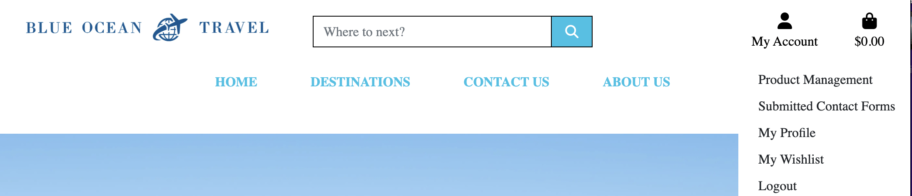

- The Hero image will inspire the users to explore the different product 	offerings as the photos will be extremely appealing and the user will want to learn more about these destinations. This section also contains a clickable link to bring users to the products page.
  

- The Why us section will showcase the different Unique Selling Points for blue ocean travel and this will encourage users to book with the company and save themselves some money in the process.
  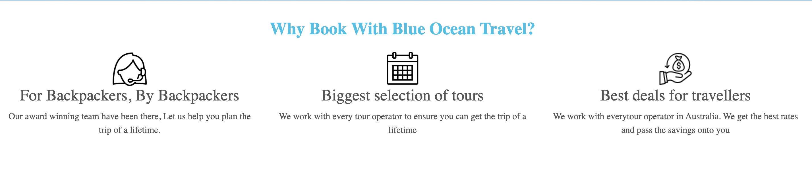

- The destination section will include clickable images that will bring the users to the product page that outlines all of the different tours offered in each location
  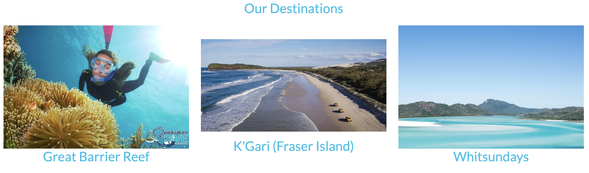

- The footer section allows the user to view the company’s social media, internal website links and a brief company description to help users better understand the company’s product offerings.
  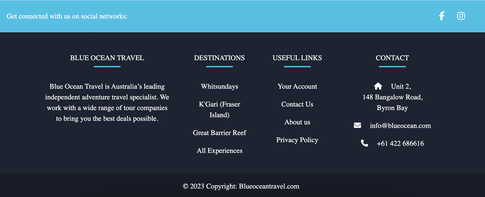

__Navigation Menu__ 

  - The Navigation contains links for Home, Destinations, Contact us and About Us.
    The destinations link contains a drop down menu for all tours, Whitsundays, K'Gari (Fraser island) and the Great Barrier Reef.

  - The following navigation items are available on all pages:

|Link|Location  |Pass/Fail|
|--|--|--|
|  Logo | index.html |Pass|
|Home|index.html|Pass|
|Destinations/All Tours|products.html|Pass|
|Destinations/K'gari(Fraser Island)|products.html with filter for K'gari products|Pass|
|Destinations/Whitsundays|products.html with filter for whitsundays products|Pass|
Destinations/Great Barrier Reef|products.html with filter for Great Barrier Reef products|Pass|
|Contact Us|contact.html|Pass|
|About Us|about.html|Pass|

  - When a user is not logged in they can still click the "My account" drop down menu. This will provide two seperate links: Register and Log in.

  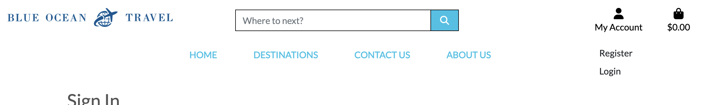
  |Link|Location  |Pass/Fail|
|--|--|--|
|Register|all auth registration page|Pass|
|Log in | all auth log in page| Pass

  - When user is logged in the "My Account drop down link will have several links: Product Management, Submitted Contact Forms, My Profile, My Wishlist, Logout.

  

|Link|Location  |Pass/Fail|
|--|--|--|
|Product Management|add_tour.html|Pass|
|Submitted Contact Forms | staff.html| Pass|
|My Profile|Profile.html|Pass|
|My Wishlist|wishlist.html|Pass|
|Logout|All auth logout page|Pass|

- If a user is a superuser or a staff member all of the above dropdown options will appear. If a user is not a staff or super user they will only see My Profile, My Wishlist, Logout.

__Footer__

 - The footer is comprised of three sections. The first section is a brief synopsis of the company. The second section is a list of links to different "Destinations" and the different products associated with those regions.

|Destinations Link|Location  |Pass/Fail|
|--|--|--|
|Destinations/All Experiences|products.html|Pass|
|Destinations/K'gari(Fraser Island)|products.html with filter for K'gari products|Pass|
|Destinations/Whitsundays|products.html with filter for whitsundays products|Pass|
|Destinations/Great Barrier Reef|products.html with filter for Great Barrier Reef products|Pass|

- There is another section of links that will take you to "Your Account", "Contact Us", "About Us" and "Privacy Policy".

|Destinations Link|Location  |Pass/Fail|
|--|--|--|
|Your Account|Profile.html|Pass|
|Contact Us|contact.html|Pass|
|About Us|about.html|Pass|
|Privacy Policy|privacy.html|Pass|

- There is also a Contact section in the footer that allows users to contact the company directly via phone or email.

|Action|Application  |Pass/Fail|
|--|--|--|
|Send Email|Open Email Client|Pass|
|Phone company|Open facetime on desktop|Pass|

__Register Page__

- If users do not have an account they will be brought to a sign up page where they can create an account. 
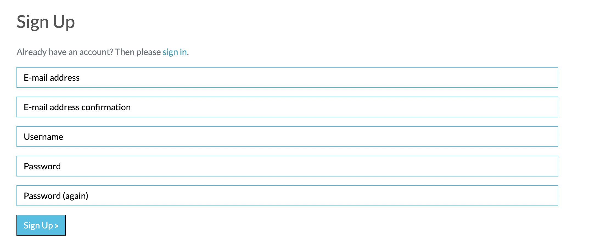

- Users can fill out their information here and are then brought to an email verification page.
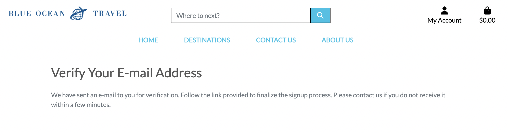

__Log In Page__
- If users have an account they will be brought to a login page where they can sign into their account. 
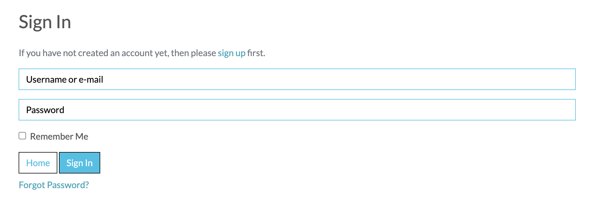

- If users log in succesfully they will be redirected to the homepage.

- If users input the incorrect information they will be given the following error
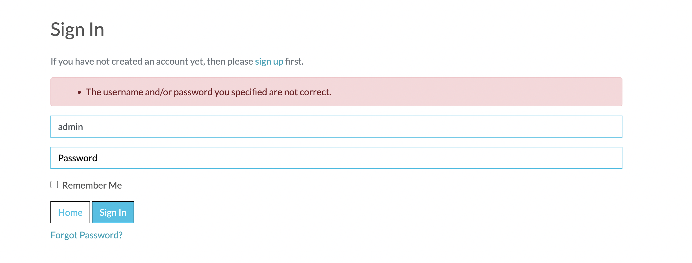

__Sign out page__
- If a user wants to leave the site they can click the Log Out button and this will take them to the sign out page.
    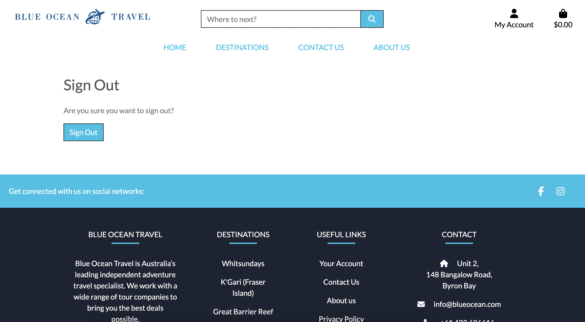

- Users will then be redirected to the homepage

__Contact Us Page__

  - The contact us section allows the users to contact the company directly if they have any issues. 

  - The user can contact the company by filling out and submitting a form. This adds to the user experience as the user may have some questions that they need answered before they are prepared to make a booking.

  - This also allows the user to contact the company if they wish to have a personalised itinerary created for them.

  - Users will also have the ability to contact the company directly via the footer as both the email and telephone icon are clickable links. If the user clicks either of these options it will allow them to email or call the company directly.

  - Users can also sign up for the company's mailing list throgh the Contact Us Page

  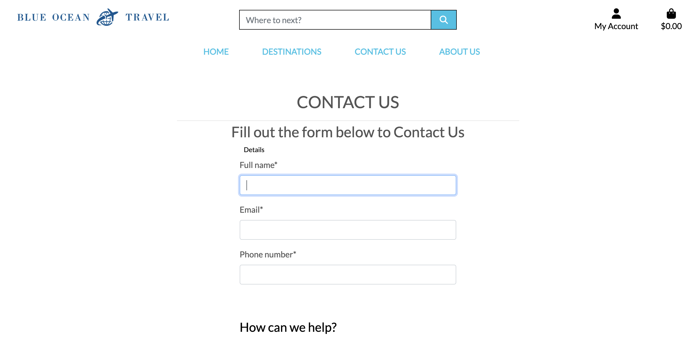
  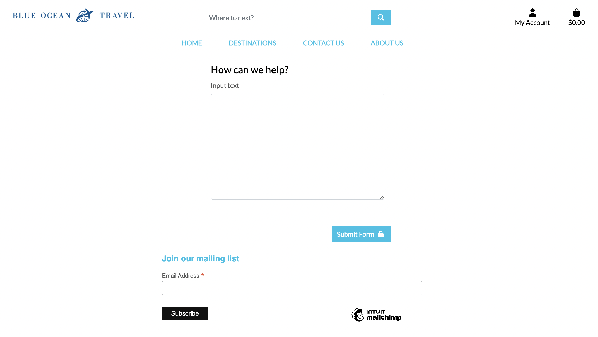

  - If the users submission is succesfull they are redirected to a success page

  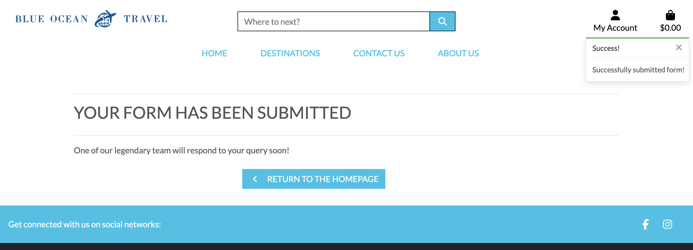

  - This page also has an option for users to sign up to the company's mailing list via a survey monkey link
  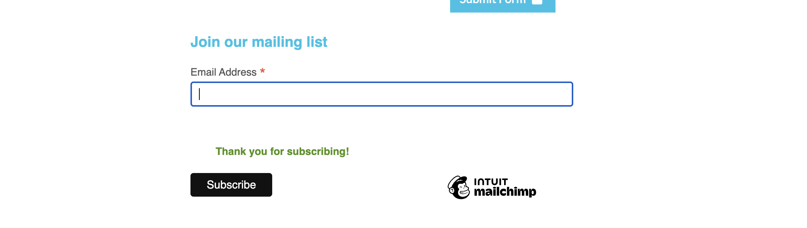

__About Us Page__

 - The about us section includes information such as Who are we, what do we do and also includes an FAQ section. This is a page for users to learn more about the company.

 - The hero image includes a large photo of our team and also gives the user a link back to the homescreen
 

 - Who Are we?
  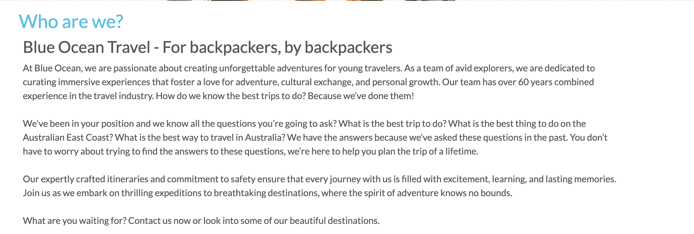

- What do we do?
  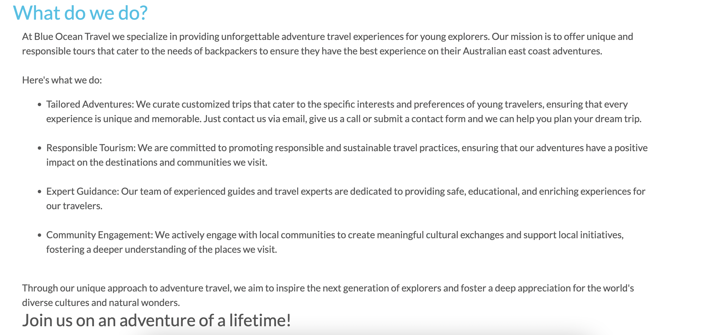

- This page also has a responsive Frequently Asked Questions accordion section.
  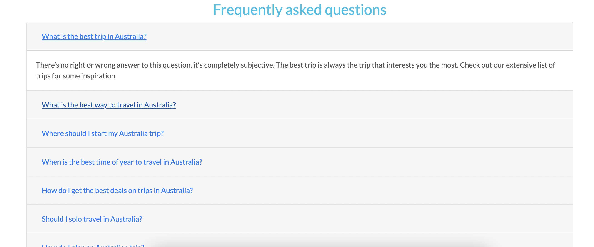

__Add Product Page__

  -  Super users and staff users can add products to the werbsite via the Product Management page. This allows staff to add products without having to access the backend.

  - Users just need to fill in the required information sections and they have the option to upload an image aswell.

  - Users will have the options to select which region the product is based in.

  - Once this has been completed the product will be added to the backend database and be visible in the all tours section.

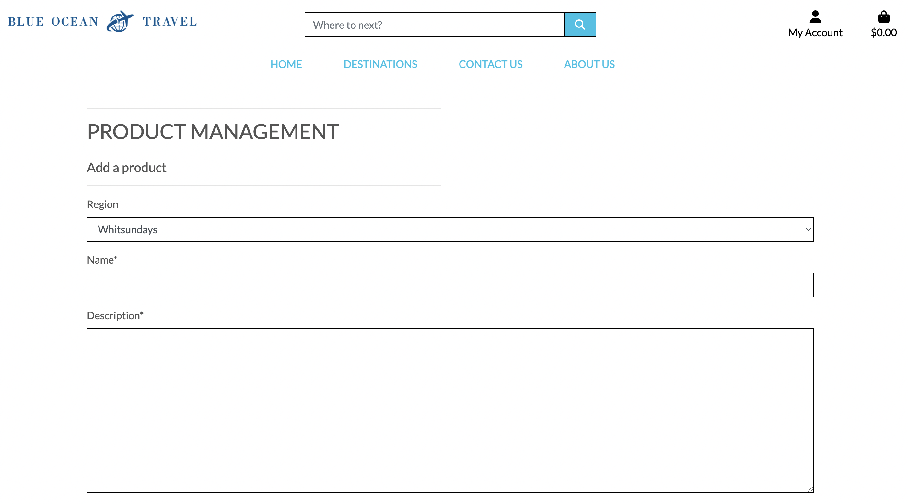
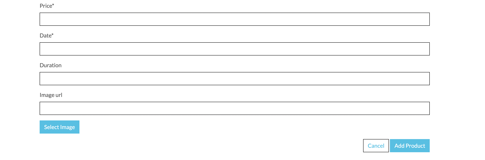

__Product Page__ 

  - The main purpose of the website is for users to be able to view and organise   different experiences around Australia. The users has several different options to view the products. They can view all products or choose the view based on different regions in Australia.

  - Users can also filter their view of the products based on different filters. They can view the products by changing the sort order from price either low to high or by rating. 

  - Users can view individual tour information through this page ranging from price, region, departure date and product rating
  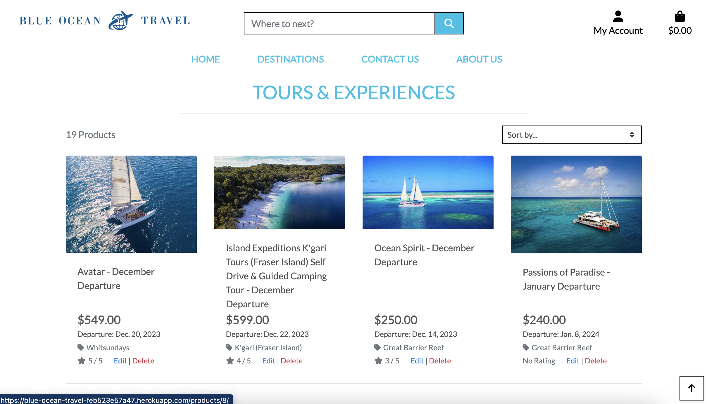

__Product Detail Page__ 
  - The product detail page will allow the user to view the tour in more detail. 

	- This page has a detailed description of the tour. It will also includes price, region, duration and ratings.

  - All users can view the products and ratings of the tours.

  - Authenticated users will be able to leave their own ratings and reviews aswell as adding products to their wishlist

  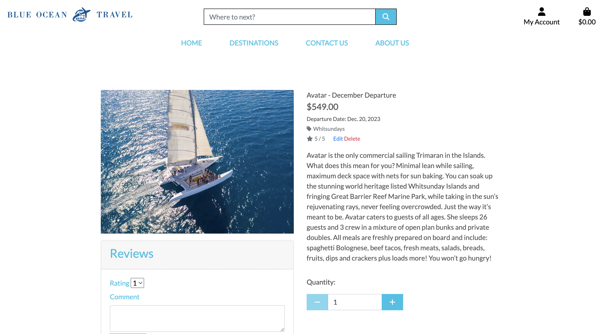
  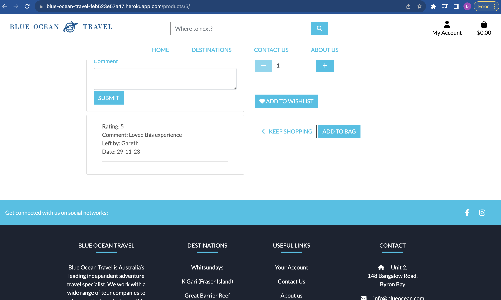

__Product Delete__

Staff users can click the delete which will take them to a delete product page

Users will have the option to return to the products page or delete the product. If the user opts to delete the product
they will be taken to the products page and the product is removed from the database.

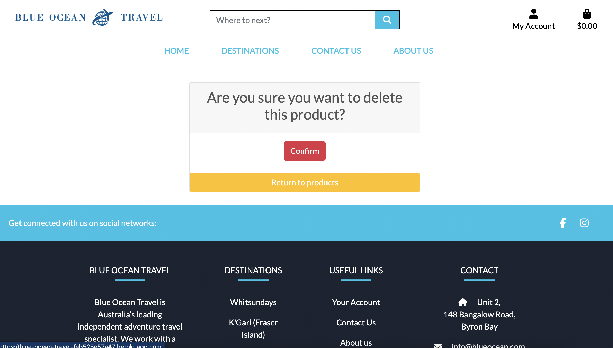

__Edit Product Page__

Staff or superusers can select to edit the product and they will be taken to a form identical to the add product page.

This form will be autofilled with the product information from the database.

Users can change the details and resubmit the product to the database

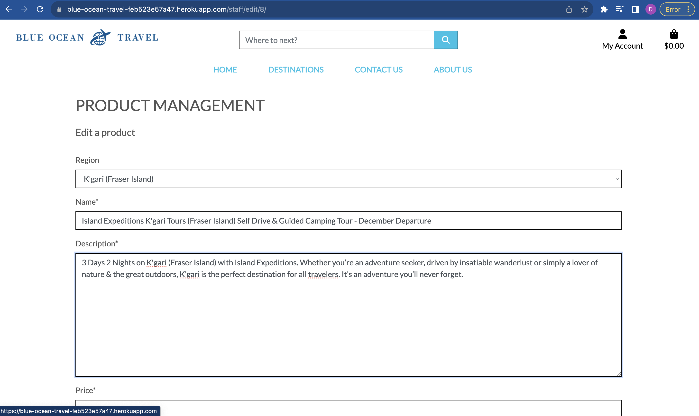
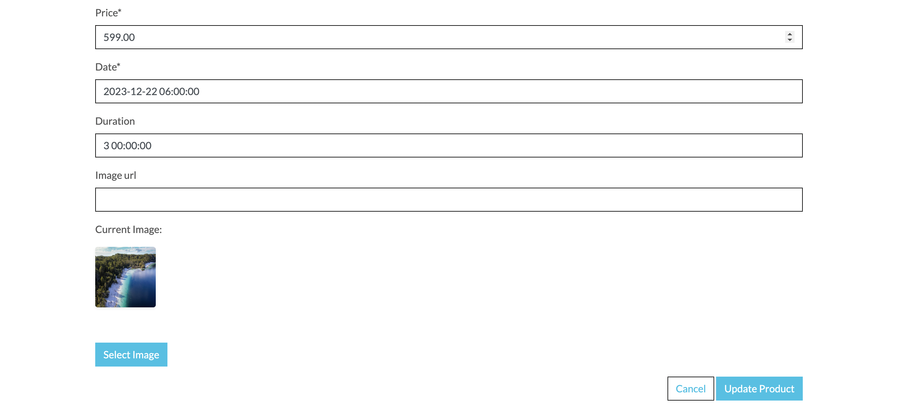

__Wishlist__

  - Users will have the ability to add items to their wishlist from the product detail page.

  - This will take the users to a seperate page where they can view the list of items they've added to their wishlist. Users can then delete these items from their wishlist.

  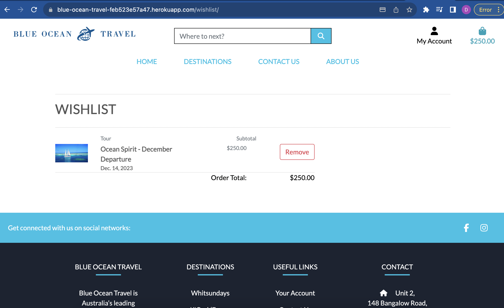

__Profile page__

  - The profile page will allow users to view their profile information.

	- Users will be able to edit their phone number and email address through this page
	
	- Users will also be able to see the tours they already have organised and purchased

__Shopping Bag__

  - Users will be able to view different tour and experiences that they have added to their cart through the shopping bag page.

	- Users will also be able to increase or decrease the amount of guests going on the tours through the shopping bag page.
	
	- Users are also able to remove any tours they do not want from the shopping bag page

	- If users are happy to proceed with their selected tour they can click the “Secure Check-out” button and this will take them to they payment page.

__SecureCheckout__

	- This page will allow users to view their shopping bag one last time and process payment

	- Users will be able to input their personal information in this section

	- Users will also be able to use a built-in stripe payment element to input their card information and process payment.

__StaffSection__

  - This section will allow staff members to view any contact forms that have been submitted by users.

	- This section will also allow staff members to fill out a form which will in turn add new products to the website. This option makes it easy for staff to update the product offering without giving them full access to the admin panel.

__Favicon__

  - The favicon was created using the company logo. This favicon sits in the web browser tab and instantly allows the user to recognise the webpage. This adds to the customer experience. The favicon is the globe and plane image that features prominently in the company logo

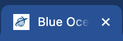

### Features Left to Implement

  -  I would like to add further email authentication
    - I would like to have users confirm their email addresses upon registration.

  - I would also like to implement user profiles. This would allow users to upload profile photos, include some information about themselves and also provide information about which services they are looking for.

## Testing 

I created an extra [Testing](https://github.com/d-lynch95/Blue_Ocean_Travel/blob/main/Testing.md) page as the file was too large to fit in this README.

### BUGS
 - I encountered several bugs while creating this project.

- I had an issue with the AWS settings as I had been using AWS_S3_REGION_NAME = 'Europe (Ireland) eu-west-1' this was fixed by changing the settings to AWS_S3_REGION_NAME = 'eu-west-1'.

- I had an issue in that when I was connecting AWS and trying to deploy my project the backend django admin panel was wiped of it users and product data. This error was due to the ProcFile being located in the 'blue_ocean' folder and not being in the root directory.

- I was having an issue loading the contact.html page when it was originally created. This was due to the file path set up as the template folder within the contact app did not have an additional 'contact' folder within it. Once I added this folder the issue was resolved.

- When adding the elephantsql database all of my products and users disappeared from the database. In order to restore them I needed to disconnect from the database, download a json file from the original database, then reconnect to the database and upload the json file with the fixtures. This resolved the issue.

- I had an issue when trying to allow users to filter products by region. I made a lot of alterations to this code segment to try and fix the issue but ultimately this was caused by having a typo in the html code. When I changed 'regions' to 'region' this corrected the issue.

- I had several issues with version control. One issue was with using Django 4.2 and csrf tokens. An error was being thrown when I tried to load my forms. This was fixed by addding the following code segment to the settings.py file "CSRF_TRUSTED_ORIGINS = ['https://8000-dlynch95-blueoceantrave-v5j6nx6eqnx.ws-us106.gitpod.io']".

- I also had an issue with the AllAuth app and my version of django. This was causing issues however i changed to allauth version 0.51.0 and this fixed the issues

- I had a bug when creating my contact us form. This was due to using the DESTINATIONS tuple in my model. Once I moved this outside the model it fixed the issue.

- I had a bug with the type of crispy forms I had installed and the forms weren't working. Once I installed an older version of crispy forms this corrected the issue as it was now compatible with the django version I was using

- I was having an issue with using a carousel. The code I was using would not render the carousel correctly. Upon further research I realised that carousels are generally not compliant with accessibility standards. Instead I opted to use a hero image instead of a carousel.

- I had a bug with the main Nav as it was not allowing the user to get through to the clickable link locations. This was because I had added the links to the mobile-top-header file but had not included them in the base.html file. Once I included them in base.html this solved the issue

- I was having an issue with my webhooks. They were not sending the success emails. This was due to an extra "}" in the code which was causing an issue. I was also using the intent.charges format from the boutique ado code. Once I changed this to the stripe_charge format the webhooks started to work and the payment intent was passed through to stripe

- I had an issue with the contact us form. It was not feeding through to the admin panel. This was due to not including the form information in the admin.py file and not creating a seperate view for the form submission success page.

- I had a bug in the footer section. It was bleeding into the Div above it and distorting the content.I fixed this by changing the class from "secrtion-row" to just "row" and this corrected the issue.

- I had a bug in that the ratings were showing up as long string decimal numbers. I fixed this by adding round() infront of my calculations in my ratings model

- I was having an issue getting the product to delete when requested by a staff member, this was because I had two views pointing to the same location. Once I fixed this the issue was resolved

- I was having issues with the favicon as I was trying to link without using the  link in the head section.

- There was an issue with the profile page as the order total data was not showing. This was because the code was using order.total instead of order.order_total

### User Testing

The application was tested on a macbook air using the google chrome browser.

I also tested it on the following mobile devices:
  OnePlus NordCE
  Iphone12
  Samsung Galaxy S
All of these devices worked as intended.

I did not test this site on a tablet but did utilise the google chrome Dev tools.

### Validator Testing 

- Python
  - No errors were found when passing through the [CI code linter](https://pep8ci.herokuapp.com/#)

  
See Linter results</sumary>

  
  

  
  

  

  

  

  

  

  

### Manual Testing

#### Functional Testing 
I created a seperate [Testing.md](https://github.com/d-lynch95/Portfolio-Project4/blob/main/Testing.md) file that outlines all of the tests completed

### Unfixed Bugs
 - There are no current bugs that we're aware of.

## Deployment

- The site was deployed to GitHub pages. The steps to deploy are as follows: 
  - In the GitHub repository, navigate to the Settings tab 
  - From the source section drop-down menu, select the Main Branch
  - Once the main branch has been selected, the page will be automatically refreshed with a detailed ribbon display to indicate the successful deployment. 

The live link can be found here - [Blue Ocean Travel](https://blue-ocean-travel-feb523e57a47.herokuapp.com/)

- Clone the Repository Code Locally
  - Navigate to the GitHub Repository you want to clone to use locally:

  - Click on the code drop down button
  - Click on HTTPS
  - Copy the repository link to the clipboard
  - Open your IDE of choice (git must be installed for the next steps)
  - Type git clone copied-git-url into the IDE terminal
  - The project will now of been cloned on your local machine for use.

- Fork the repository
  - For creating a copy of the repository on your account and change it without affecting the original project, useFork   directly from GitHub:

  - On My Repository Page, press Fork in the top right of the page
  - A forked version of my project will appear in your repository

- Heroku 
  - The project was deployed using Code Institutes mock terminal for Heroku

  - Deployment steps:

    - Fork or clone this repository.

    - Ensure the Profile is in place.

    - requirements.txt can be left empty as this project does not use any external libraries

    - Create a new app in Heroku

    - Select "New" and "Create new app"

    - Name the new app and click "Create new app"

    - In "Settings" select "BuildPack" and select Python and Node.js. (Python must be at the top of the list)

    - Whilst still in "Settings", click "Reveal Config Vars" and input the folloing. KEY: PORT, VALUE: 8000. Nothing else is needed here as this project does not have any sensitive files

    - Click on "Deploy" and select your deploy method and repository

    - Click "Connect" on selected repository.

    - Either choose "Enable Automatic Deploys" or "Deploy Branch" in the manual deploy section

    - Heroku will now deploy the site

## Credits 

### Content 

- The format and template for the README file was borrowed from the [Code institute](https://codeinstitute.net/ie/).

- The images were taken from [Pexels](https://www.pexels.com/) and [Unsplash](https://unsplash.com/)

- The image conversions from jpg to webp were done with [Convertio](https://convertio.co)

- The code for the carousel was borrowed from W3Schools Sample Project

- The code for the 'Why us' section was borrowed from [BackPackerdeals](https:/backpackerdeals.com)

- The code for the footer was taken from [MDBootstrap](https://mdbootstrap.com/how-to/bootstrap/footer-add/)

- The styling and colour scheme inspiration was taken from [BarefootCampers](https://www.barefootcampers.nz/)

- The review code was inspired by [CodewithStein](https://www.youtube.com/watch?v=8iCqlFyFu2s)

- The code for the accordion on the About Us page was taken from the [Bootstrap Documentation](https://getbootstrap.com/docs/4.6/components/collapse/#accordion-example)

- I created the sitemap.xml file at [MySiteMapGenerator](https://www.mysitemapgenerator.com/)

### Coding help

- The outline template for the Python was provided by the [Code Institiute](https://www.codeinstitute.com)

- The hero image code was taken from my [PP1](https://github.com/d-lynch95/Portfolio-1-GreatOceanRoadsters/blob/main/css/style.css)

- I also took a lot of inspiration from the Code institute Boutique Ado Walk through [Code Institiute](https://www.codeinstitute.com)

- A lot of the python coding was done with help from the tutorial pages at [w3schools](https://www.w3schools.com/)

- The Django documentation was one of the main resources I used during development [Django Documentation](https://docs.djangoproject.com/en/4.2/)

- The code for the wishlist add item came from [StackOverflow](https://stackoverflow.com/questions/56580696/how-to-implement-add-to-wishlist-for-a-product-in-django)

- The tutor support team from codeinstitute were extremely helpful in helping me to overcome bugs in my code.

- I used countless stack overflow entries to help me to solve minor django related bugs.

- I used the following projects as inspiration for my project. [SizzleAndSteak](https://github.com/Gareth-McGirr/Portfolio-Project-4-SizzleAndSteak), [TennisBuddies](https://github.com/lucia2007/tennis_buddies), [BurgerBar](https://github.com/LADCode2021/pp4-burger-bar), [Itallianisimo](https://github.com/useriasminna/italianissimo-booking-website), [KiwiPiano](https://github.com/VeronicaLourens/kiwipiano)

 - I also received help from the following slack users for minor bugs or style changes inc21, Tatiana Ruffo, Dave T, Laura, Jo_ci and I received a lot of help and advice from my mentor Gareth McGirr and from Paul Thomas our cohort leader.