# Testing home page

## Link tracking 

### Home Page
|Link|Location  |Pass/Fail|
|--|--|--|
|  Logo | index.html |Pass|
|Home|index.html|Pass|
|Destinations/All Tours|products.html|Pass|
|Destinations/K'gari(Fraser Island)|products.html with filter for K'gari products|Pass|
|Destinations/Whitsundays|products.html with filter for whitsundays products|Pass|
Destinations/Great Barrier Reef|products.html with filter for Great Barrier Reef products|Pass|
|Contact Us|contact.html|Pass|
|About Us|about.html|Pass|

- When a user is not logged in they can still click the "My account" drop down menu. This will provide two seperate links: Register and Log in.

|Link|Location|Pass/Fail|
|--|--|--|
|Register|all auth registration page|Pass|
|Log in | all auth log in page| Pass|

- The Register link will take them to the following page
    
- The log in link will take them to the following page
    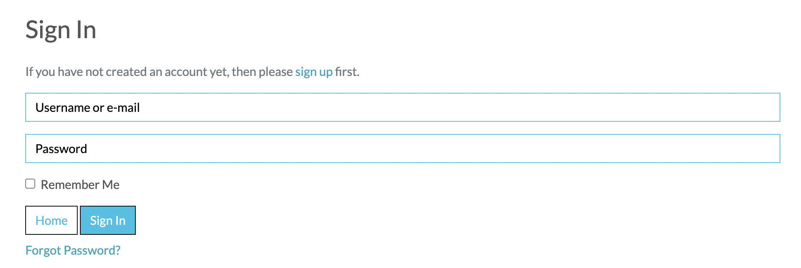

- When a user clicks the destinations images on the homepage they will be taken to a different location

|Destinations Link|Location|Pass/Fail|
|--|--|--|
|Destinations/All Tours|products.html|Pass|
|Destinations/K'gari(Fraser Island)|products.html with filter for K'gari products|Pass|
|Destinations/Whitsundays|products.html with filter for whitsundays products|Pass|
|Destinations/Great Barrier Reef|products.html with filter for Great Barrier Reef products|Pass|

###  Footer

 - The footer is comprised of three sections. The first section is a brief synopsis of the company. The second section is a list of links to different "Destinations" and the different products associated with those regions.

|Destinations Link|Location  |Pass/Fail|
|--|--|--|
|Destinations/All Tours|products.html|Pass|
|Destinations/K'gari(Fraser Island)|products.html with filter for K'gari products|Pass|
|Destinations/Whitsundays|products.html with filter for whitsundays products|Pass|
|Destinations/Great Barrier Reef|products.html with filter for Great Barrier Reef products|Pass|

- There is another section of links that will take you to "Your Account", "Contact Us", "About Us" and "Privacy Policy".

|Destinations Link|Location  |Pass/Fail|
|--|--|--|
|Contact Us|contact.html|Pass|
|About Us|about.html|Pass|
|My Profile|Profile.html|Pass|
|Privacy Policy|privacy.html|Pass|

- There is also a Contact section in the footer that allows users to contact the company directly via phone or email.

|Action|Application  |Pass/Fail|
|--|--|--|
|Send Email|Open Email Client|Pass|
|Phone company|Open facetime on desktop|Pass|

### Log In Page
|Action|Result|Pass/Fail|
|--|--|--|
|Log in|Redirected to homepage|Pass|
|Log in with incorrect information|Error Message|Pass

- If users have an account they will be brought to a login page where they can sign into their account. 

- If users log in succesfully they will be redirected to the homepage.

- If users input the incorrect information they will be given the following error

- If the user has forgotten their password they can go to the following page
    

- Once the user enters their email they will be sent a link to set up a new password and redirected
    

### Sign out page
|Action|Result|Pass/Fail|
|--|--|--|
|Sign out|Redirected to homepage|Pass|

- If a user wants to leave the site they can click the Log Out button and this will take them to the sign out page.
    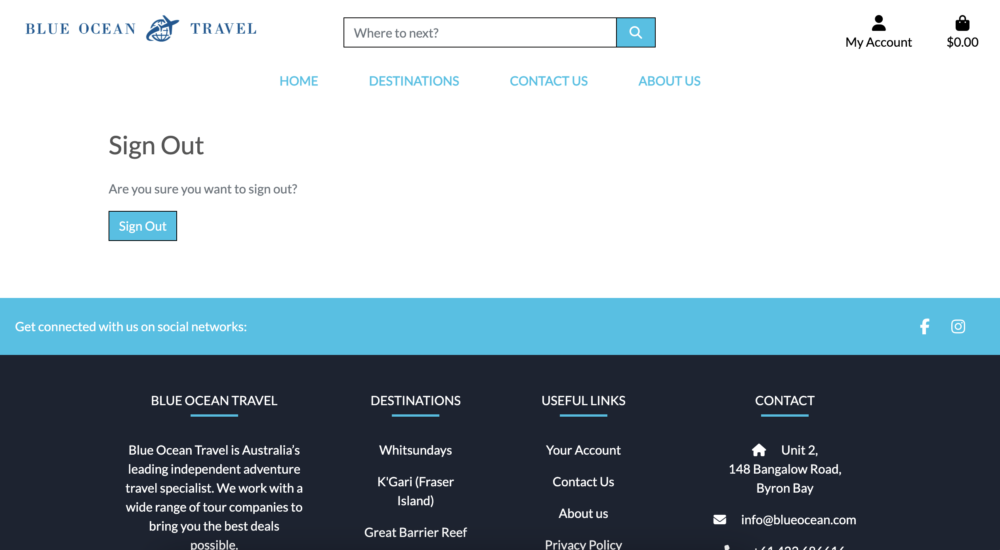

- Users will then be redirected to the homepage

### About Us Page

This page includes a large hero image with one link to return to the homepage

 

 |Link|Location|Pass/Fail|
 |--|--|--|
 |Plan your next adventure|products.html|Pass|

The about us page also includes and FAQ accordion. Each of these accordion drop downs was tested individually

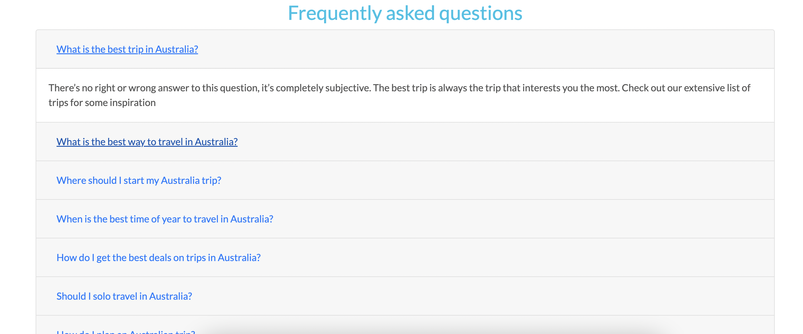

|Title|Text Displayed|
|--|--|
|What is the best trip in Australia|Yes|
|What is the best way to travel in Australia|Yes|
|Where should I start my australia trip|Yes|
|When is the best time of year to travel in Australa|Yes|
|How do I get the best deals on trips in Australia|Yes|
|Should I solo travel in Australia|Yes|
|How do I plan an Australia trip|Yes|
|Should I stay in hostel|Yes|
|What are the main attractions in Australia|Yes|
|How do I know which trip is best for me|Yes|

### Contact Us Page

The contact us section allows the users to contact the company directly if they have any issues. 

The user can contact the company by filling out and submitting a form. This adds to the user experience as the user may have some questions that they need answered before they are prepared to make a booking.

This also allows the user to contact the company if they wish to have a personalised itinerary created for them.

Users will also have the ability to contact the company directly via the footer as both the email and telephone icon are clickable links. If the user clicks either of these options it will allow them to email or call the company directly.

Users can also sign up for the company's mailing list throgh the Contact Us Page

  
  

If the users submission is succesfull they are redirected to a success page
  

The contact us form comes with several validators that will not submit if fields are blank or with the wrong data type.
The Name, Email and Phone fields must all be filled out however the text box can be submitted empty

|Field|ValidationWarning|Yes/No|
|--|--|--|
|Name|Please fill in this field|Yes|
|Email|Please fill in this field|Yes|
|Phone|Please fill in this field|Yes|

If name field is not filled in the following error shows
    

If email field is not filled in the following error shows
    

If phone field is not filled in the following error shows
    

Users also have an option to sign up for the company's mailing list
    

If users input an invalid email address they will be met with the following error messages
    
    

### Contact form submissions

Submitted contact forms will go to a page that is only accessible to super users and staff users.

Staff members can view the submitted forms and queries and then click the button to respond to the guest via email

Staff members can open up an email client to respond directly to the guest

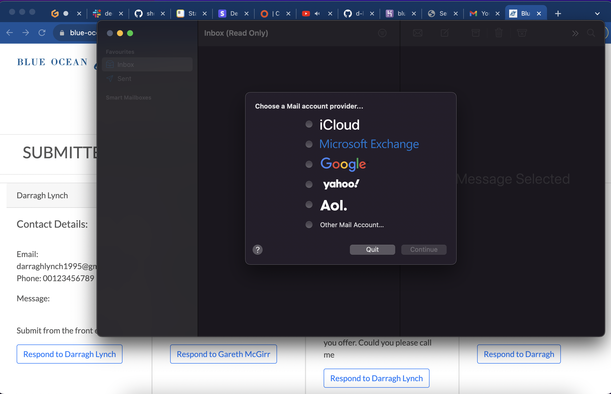

### Add Product Page

Super users and staff users can add products to the werbsite via the Product Management page. This allows staff to add products without having to access the backend.

Users just need to fill in the required information sections and they have the option to upload an image aswell.

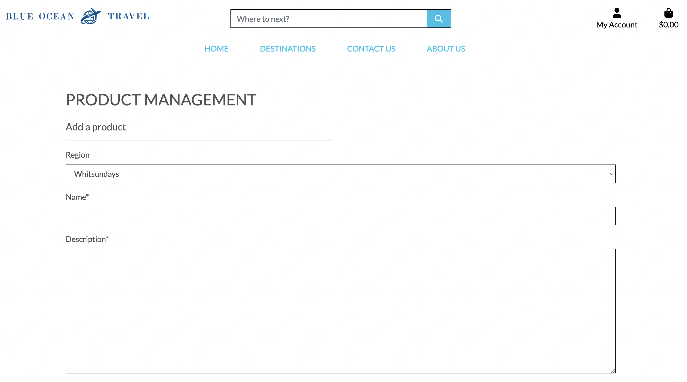
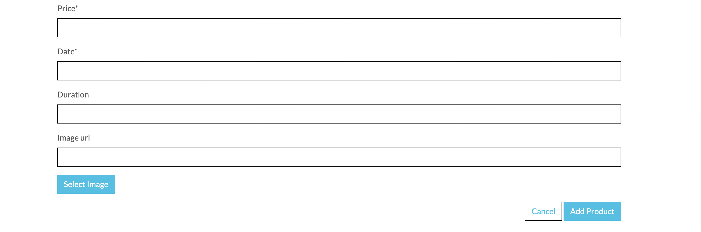

This product management form was created with validation requirements.

|Field|ValidatoinWarning|Yes/No/Not Required|
|--|--|--|
|Region|Please fill in this field|Not required|
|Name|Please fill in this field|Yes|
|Description|Please fill in this field|Yes|
|Price|Please fill in this field|Yes|
|Date|Please fill in this field|Yes|
|Duration|Please fill in this field|Not required|
|Image URL|Please fill in this field|Not required|

Users will first be given an option to add in the Region in which the product is located

Users will first be given an option to add a name field which is required

Users will first be given an option to add a product decription which is required

Users will first be given an option to add a price which is required

The product must be limited to two decimal places of there will be an error

Users will first be given an option to add a date which is required

Users do not need to fill in the duration or image in order to add the product to the database

### Product Page 

- Users can also filter their view of the products based on different filters. They can view the products by changing the sort order from price either low to high or by name. 

- Users can view individual tour information through this page ranging from price, region, departure date and product rating
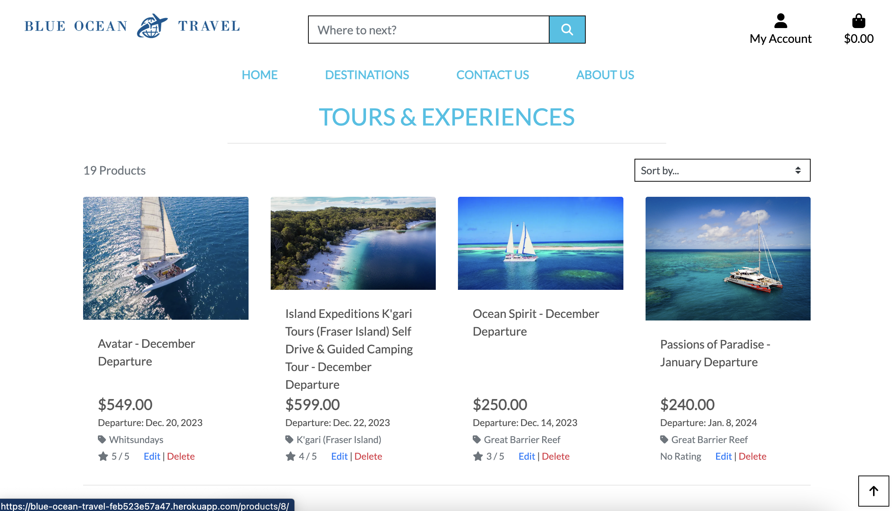

|Link Clicked|Result|Pass/Fail|
|--|--|--|
|Product image|product_detail.html|Pass|
|Edit|edit_tour.html|Pass
|Delete|delete_tour.html|Pass|
|retun to top arrow|Top of product page|Pass|

Users can also use the sort box in order to change the sorting of the products

Users can sort by pricing either low to high or high to low

Users can sort by Name either from A-Z or reverse alphabetical from Z-A

### Product Detail page
The product detail page will allow the user to view the tour in more detail. 

This page has a detailed description of the tour. It will also includes price, region, duration and ratings.

All users can view the products and ratings of the tours.

Authenticated users will be able to leave their own ratings and reviews aswell as adding products to their wishlist

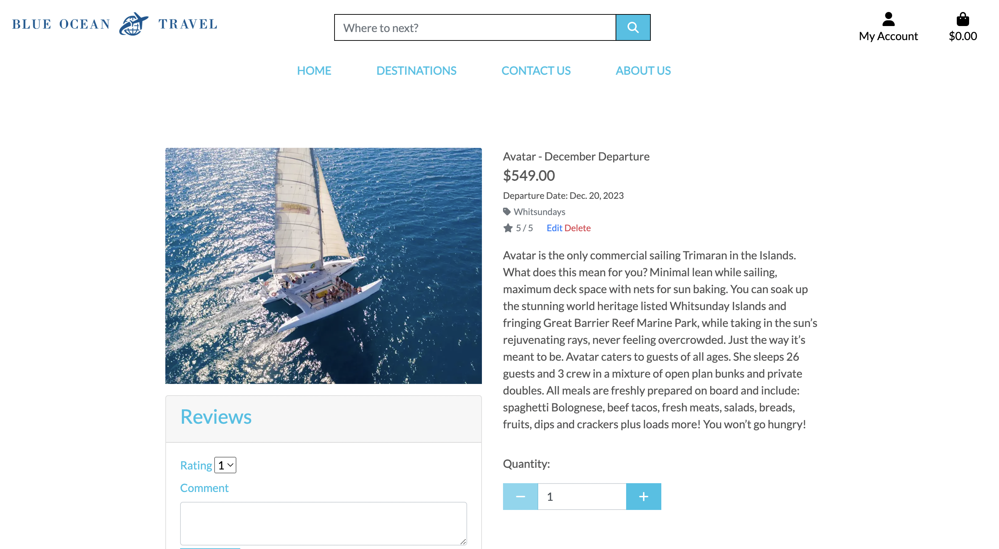
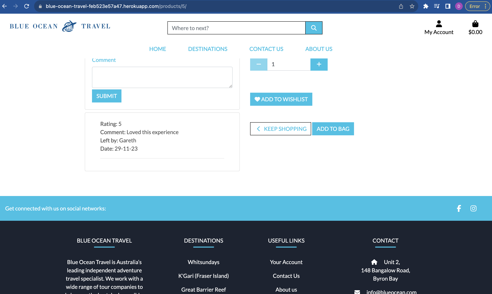

If the user is not authenticated they will see the following view

Unregistered users can still add items to their bags and complete transactions

Logged in users will have a different viewpoint as they will be able to leave reviews, add products to wishlist and add items to their bag

|Link Clicked|Result|Pass/Fail|
|--|--|--|
|Add to wishist|add to wishlist and redirect to wishlist.html|Pass|
|Quantity +|quantity increases |Pass
|Quantity -|quantity decreases|Pass|
|Keep shopping|return to products page|Pass|
|Add to bag|Product added to bag|Pass|
|Submit review|IF Blank review should not submit|Pass|
|Submit review| submit if review has been filled|Pass|

### Add to Wishlist

Users can add items to their wishlist from the product detail page

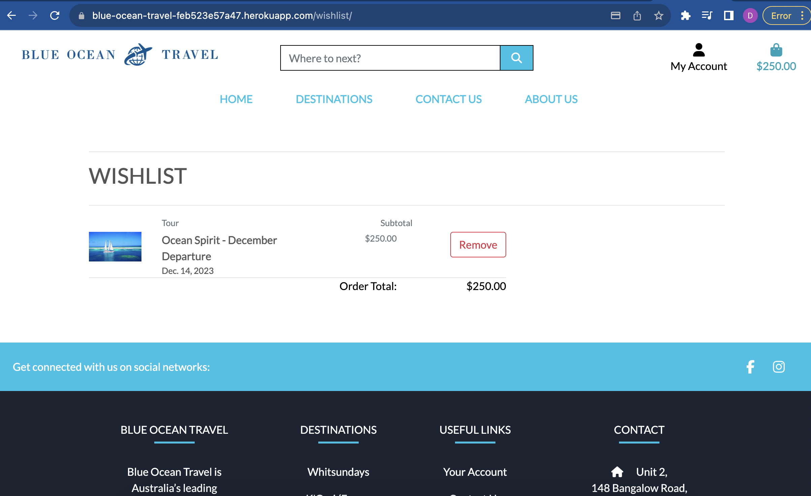

Users can also remove items from their wishlist by clicking the remove button on the wishlist page

### Remove from wishlist 

Users can remove items from the wishlist. They will then be sent a toast to confirm that the item has been removed from their wishlist. Users will remain on the wishlist page as it is possible they may have multiple items on their list.

### Reviews

Users will be able to leave reviews for individual products on the product_description page

If the review section is left blank users will not be able to submit.

If a user is logged in and has left a review they will be able to submit it

When a review has been submitted the user will receive a toast notification and see the review on the product detail page

Users will not be able to submit multiple reviews. Instead when a user attempts to create a new review it will just edit the review they have previously submitted. This has been tested and confirmed to be the case

### Delete Product page

If staff or superusers select to delete a product they will be taken to the delete_tour.html page.

This page contains a card with two buttons to either confirm deletion of the product or return to the products page

|Link Clicked|Result|Pass/Fail|
|--|--|--|
|Confirm|Product removed from database and return to products page|Pass|
|Return to products|return to products page|Pass|

Users will be shown a toast message on the homepage to confirm product has been deleted.

### Edit Product Page

Staff or superusers can select to edit the product and they will be taken to a form identical to the add product page.

This form will be autofilled witht the product information from the database.

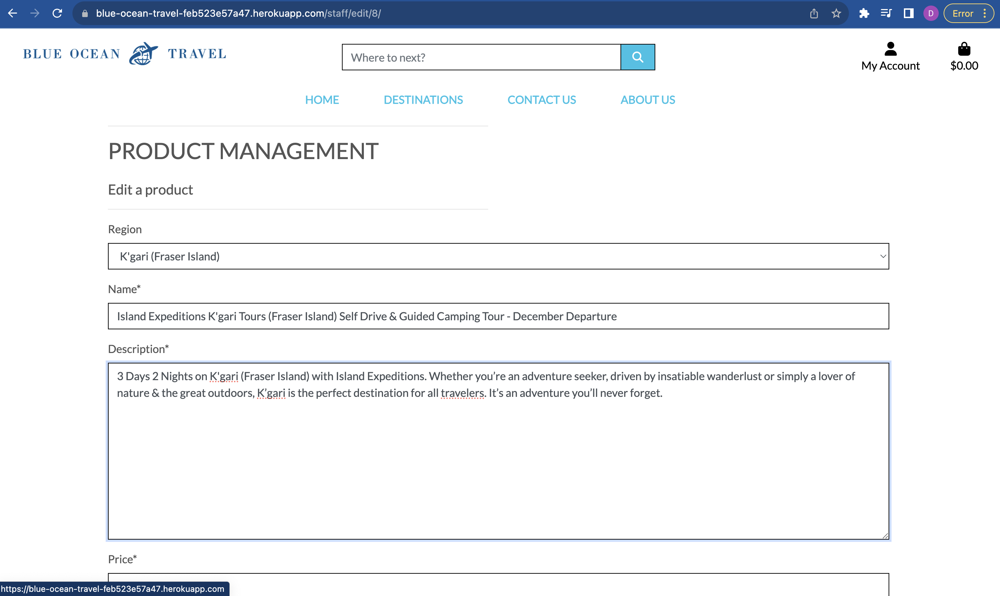

The form validation is the same as the add product page

|Field|ValidatoinWarning|Yes/No/Not Required|
|--|--|--|
|Region|Please fill in this field|Not required|
|Name|Please fill in this field|Yes|
|Description|Please fill in this field|Yes|
|Price|Please fill in this field|Yes|
|Date|Please fill in this field|Yes|
|Duration|Please fill in this field|Not required|
|Image URL|Please fill in this field|Not required|

### My Profile

Users can access the my profile page through the navbar drop down menu.

While on this page users will be able to update their personal information. There is no data validation in this section so if users wish to change their information or remove it completely they can do so.

Users can also click on their previous order numbers to see previous orders

### My orders

The my orders page can be accessed through the My Profile page.

The user can view their orders and order details on this page and when finished users can click the back to profile page and return to their profile page if that's the page they came from.

### Shopping Bag

- Users can add items to the shopping bag and are then taken to this page when they want to view the bag

|Link Clicked|Result|Pass/Fail|
|--|--|--|
|Quantity +|quantity increases |Pass
|Quantity -|quantity decreases|Pass|
|Update|This updates the product quantity in the bag|Pass|
|Remove|This removes the product from shopping bag and refreshes the bag|Pass|
|Keep shopping|return to products page|Pass|
|Secure Checkout|take user to the checkout page|Pass|

Users can adjust their bags and update the quantity of the products in their basket. This will then refresh the page and show the new price and quantity aswell as showing a toast message to the guest.

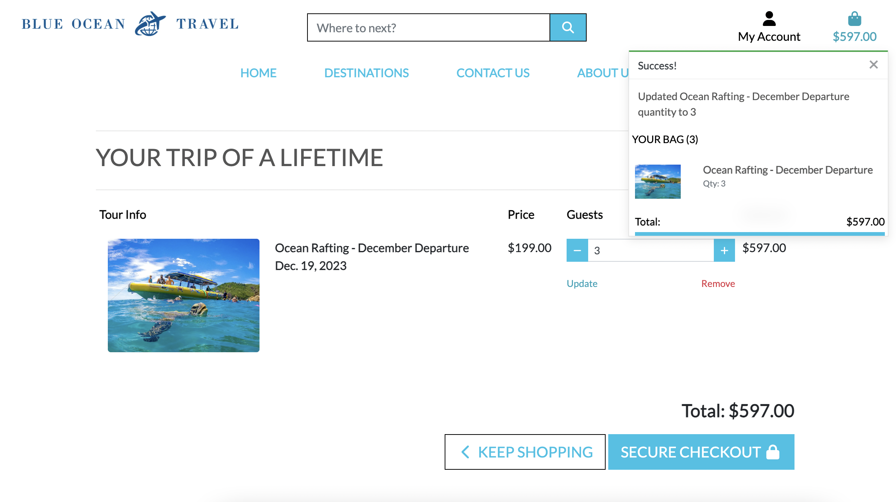

Users can also remove products from their bag from this page. Users can do this by selecting the remove button. Once this is done the page will refresh to show the new bag contents. A toast message will also be displayed to users.

Users can also select the Secure checkout button if they are happy with their shopping bag contents. This will take the user to a page where they can add their personal details if they haven't already been saved and add card details to complete a transaction.

### Secure Checkout

Users can input their personal information in this section to complete their transaction. 

If the user has already submitted their information the form will autofill

Users can then input their card details into stripe. Stripe has built in card validation errors incase there is anything wrong with user input. These were all tested individually

|Stripe Error|Message|Error message shown|
|--|--|--|
|Card number incomplete|Your Card number is incomplete|Yes|
|Wrong card number|Your Card number is invalid|Yes|
|Card expiry in the past |Your card's expiry year is in the past|Yes|
|No expiry date|Your card's expiry date is incomplete|Yes|
|CVC incomplete|Your card's security code is incomplete|Yes|
|Postcode invalid|Your Postal Code is invalid|Yes|

When the order has been complete the user will be brought to a checkout success page where they can view their purchase
From this page users will be given a button to return to the homepage

### Toasts

- Toasts have been introduced to keep users informed of different progress and activities on the site. Toasts have been included with a timer that they should only last for 5 seconds

|Toast|Action |Displayed|
|--|--|--|
|Sign In|Sign In success|Yes|
|Sign Out|Sign Out success|Yes|
|New Account|New Account Created Success|Yes|
|Contact Form|Form Submitted|Yes|
|Invalid product|User tries to add invalid product|Yes|
|Delete product|superuser deletes a product from database|Yes|
|Update product|superuser updates product info|Yes|
|Review Submitted|User submites a review|Yes|
|Removed from wishlist|user removes an item from their wishlist|Yes|
|Profile Updated|When a user updates profile information|Yes|
|Previous order|Inform user they are looking at a previous order|Yes|
|Update quantity|User updates product quantity in their bag|Yes|
|Remove item|User removes product from their bag|Yes|
|Order success|User completes a transaction| Yes|

- When a user signs in they will be sent the following Toast.
   

- When a user creates a new account they are greeted with this Toast

- When a user sign out they will see the following toast
    

- When a user submits a form will see the following toast
    

- When users try to add a product but it's not valid they will see this toast
    

- When users delete a product they will see this toast
    

- When users update a product they will see the following toast
    

- When a user submits a review they will see the following toast
    

- When a user removes a product from their wishlist they will get the following toast
    

- When a user updates their profile information they will see the following toast
    

- When a user views a previous order they will see the following toast
    

- When a user adjusts item quantity in their bag they will see the following toast
    

- When a user removes an item from the bag they will see the following toast
    

- When a user completes a transaction they will see the following toast
    

### Email confirmation

- When a user creates an account they will be brought to an email confirmation page.
    
- Users will then be sent an email to the email address provided.
   
- Users will then confirm their email and be brought to the following page
    
- If a user forgets their password they will get the following email
    
- If a user completes a transaction they will be sent the following email  
    
