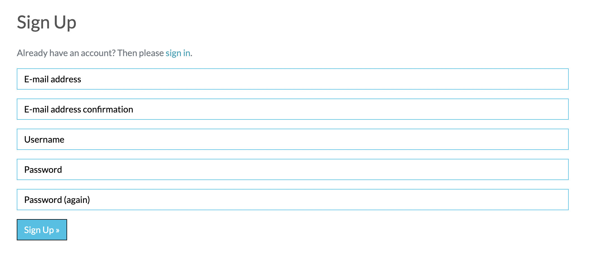
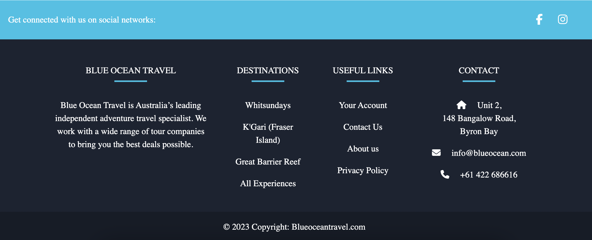
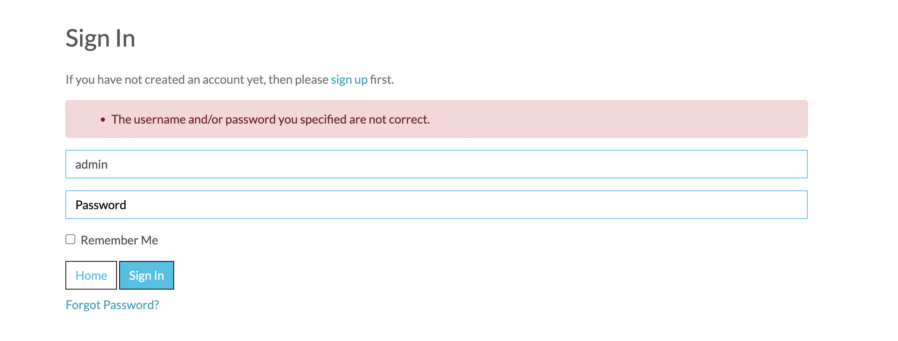

# Testing home page

## Link tracking 

### Home Page
|Link|Location  |Pass/Fail|
|--|--|--|
|  Logo | index.html |Pass|
|Home|index.html|Pass|
|Destinations/All Tours|products.html|Pass|
|Destinations/K'gari(Fraser Island)|products.html with filter for K'gari products|Pass|
|Destinations/Whitsundays|products.html with filter for whitsundays products|Pass|
Destinations/Great Barrier Reef|products.html with filter for Great Barrier Reef products|Pass|
|Contact Us|contact.html|Pass|
|About Us|about.html|Pass|

- When a user is not logged in they can still click the "My account" drop down menu. This will provide two seperate links: Register and Log in.

  |Link|Location  |Pass/Fail|
|--|--|--|
|  Register|all auth registration page|Pass|
|Log in | all auth log in page| Pass

- The Register link will take them to the following page
    
- The log in link will take them to the following page
    

- When a user clicks the destinations images on the homepage they will be taken to a different location
|Destinations Link|Location  |Pass/Fail|
|--|--|--|
|Destinations/All Tours|products.html|Pass|
|Destinations/K'gari(Fraser Island)|products.html with filter for K'gari products|Pass|
|Destinations/Whitsundays|products.html with filter for whitsundays products|Pass|
|Destinations/Great Barrier Reef|products.html with filter for Great Barrier Reef products|Pass|

###  Footer

 - The footer is comprised of three sections. The first section is a brief synopsis of the company. The second section is a list of links to different "Destinations" and the different products associated with those regions.

|Destinations Link|Location  |Pass/Fail|
|--|--|--|
|Destinations/All Tours|products.html|Pass|
|Destinations/K'gari(Fraser Island)|products.html with filter for K'gari products|Pass|
|Destinations/Whitsundays|products.html with filter for whitsundays products|Pass|
|Destinations/Great Barrier Reef|products.html with filter for Great Barrier Reef products|Pass|

- There is another section of links that will take you to "Your Account", "Contact Us", "About Us" and "Privacy Policy".

|Destinations Link|Location  |Pass/Fail|
|--|--|--|
|Contact Us|contact.html|Pass|
|About Us|about.html|Pass|
|My Profile|Profile.html|Pass|
|Privacy Policy|privacy.html|Pass|

- There is also a Contact section in the footer that allows users to contact the company directly via phone or email.

|Action|Application  |Pass/Fail|
|--|--|--|
|Send Email|Open Email Client|Pass|
|Phone company|Open facetime on desktop|Pass|

### Log In Page
|Action|Result|Pass/Fail|
|--|--|--|
|Log in|Redirected to homepage|Pass|
|Log in with incorrect information|Error Message|Pass

- If users have an account they will be brought to a login page where they can sign into their account. 

- If users log in succesfully they will be redirected to the homepage.

- If users input the incorrect information they will be given the following error

### Sign out page
|Action|Result|Pass/Fail|
|--|--|--|
|Sign out|Redirected to homepage|Pass|

- If a user wants to leave the site they can click the Log Out button and this will take them to the sign out page.
    

- Users will then be redirected to the homepage

### Toasts

- Toasts have been introduced to keep users informed of different progress and activities on the site. Toasts have been included with a timer that they should only last for 5 seconds

|Toast|Action |Displayed|
|--|--|--|
|Sign In|Sign In success|Yes|
|Sign Out|Sign Out success|Pass|
|New Account|New Account Created Success|Pass|

- When a user signs in they will be sent the following Toast.
   

- When a user creates a new account they are greeted with this Toast

- When a user sign out they will see the following toast
    

### Email confirmation

- When a user creates an account they will be brought to an email confirmation page.
    
- Users will then be sent an email to the email address provided.
    