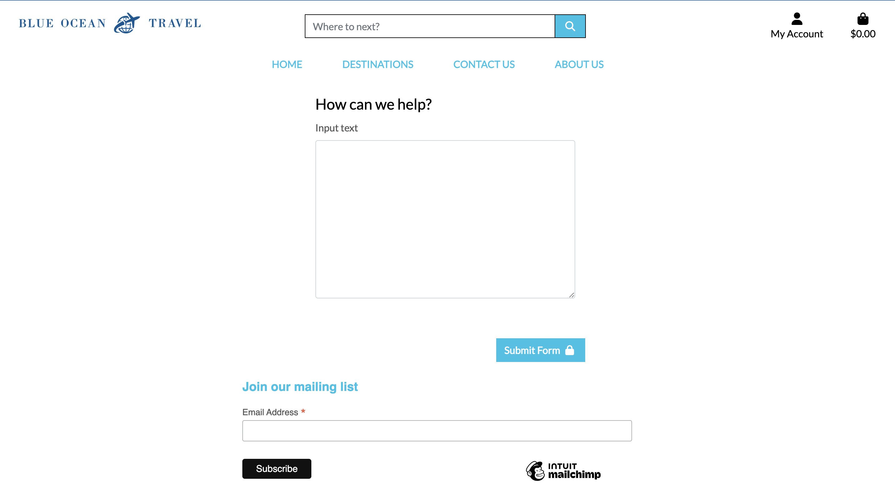
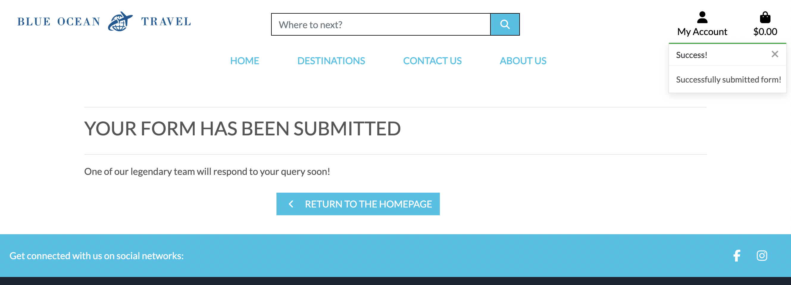
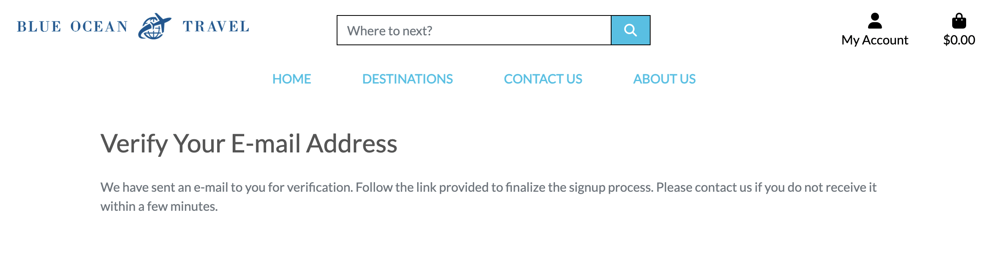

# Testing home page

## Link tracking 

### Home Page
|Link|Location  |Pass/Fail|
|--|--|--|
|  Logo | index.html |Pass|
|Home|index.html|Pass|
|Destinations/All Tours|products.html|Pass|
|Destinations/K'gari(Fraser Island)|products.html with filter for K'gari products|Pass|
|Destinations/Whitsundays|products.html with filter for whitsundays products|Pass|
Destinations/Great Barrier Reef|products.html with filter for Great Barrier Reef products|Pass|
|Contact Us|contact.html|Pass|
|About Us|about.html|Pass|

- When a user is not logged in they can still click the "My account" drop down menu. This will provide two seperate links: Register and Log in.

  |Link|Location  |Pass/Fail|
|--|--|--|
|  Register|all auth registration page|Pass|
|Log in | all auth log in page| Pass

- The Register link will take them to the following page
    
- The log in link will take them to the following page
    

- When a user clicks the destinations images on the homepage they will be taken to a different location
|Destinations Link|Location  |Pass/Fail|
|--|--|--|
|Destinations/All Tours|products.html|Pass|
|Destinations/K'gari(Fraser Island)|products.html with filter for K'gari products|Pass|
|Destinations/Whitsundays|products.html with filter for whitsundays products|Pass|
|Destinations/Great Barrier Reef|products.html with filter for Great Barrier Reef products|Pass|

###  Footer

 - The footer is comprised of three sections. The first section is a brief synopsis of the company. The second section is a list of links to different "Destinations" and the different products associated with those regions.

|Destinations Link|Location  |Pass/Fail|
|--|--|--|
|Destinations/All Tours|products.html|Pass|
|Destinations/K'gari(Fraser Island)|products.html with filter for K'gari products|Pass|
|Destinations/Whitsundays|products.html with filter for whitsundays products|Pass|
|Destinations/Great Barrier Reef|products.html with filter for Great Barrier Reef products|Pass|

- There is another section of links that will take you to "Your Account", "Contact Us", "About Us" and "Privacy Policy".

|Destinations Link|Location  |Pass/Fail|
|--|--|--|
|Contact Us|contact.html|Pass|
|About Us|about.html|Pass|
|My Profile|Profile.html|Pass|
|Privacy Policy|privacy.html|Pass|

- There is also a Contact section in the footer that allows users to contact the company directly via phone or email.

|Action|Application  |Pass/Fail|
|--|--|--|
|Send Email|Open Email Client|Pass|
|Phone company|Open facetime on desktop|Pass|

### Log In Page
|Action|Result|Pass/Fail|
|--|--|--|
|Log in|Redirected to homepage|Pass|
|Log in with incorrect information|Error Message|Pass

- If users have an account they will be brought to a login page where they can sign into their account. 

- If users log in succesfully they will be redirected to the homepage.

- If users input the incorrect information they will be given the following error

### Sign out page
|Action|Result|Pass/Fail|
|--|--|--|
|Sign out|Redirected to homepage|Pass|

- If a user wants to leave the site they can click the Log Out button and this will take them to the sign out page.
    

- Users will then be redirected to the homepage

### About Us Page

This page includes a large hero image with one link to return to the homepage

 

 |Link|Location  |Pass/Fail|
 |Plan your next adventure|products.html|Pass|

The about us page also includes and FAQ accordion. Each of these accordion drop downs was tested individually

|Title|Text Displayed|
|--|--|
|What is the best trip in Australia|Yes|
|What is the best way to travel in Australia|Yes|
|Where should I start my australia trip|Yes|
|When is the best time of year to travel in Australa|Yes|
|How do I get the best deals on trips in Australia|Yes|
|Should I solo travel in Australia|Yes|
|How do I plan an Australia trip|Yes|
|Should I stay in hostel|Yes|
|What are the main attractions in Australia|Yes|
|How do I know which trip is best for me|Yes|

### Contact Us Page

__Contact Us Page__

The contact us section allows the users to contact the company directly if they have any issues. 

The user can contact the company by filling out and submitting a form. This adds to the user experience as the user may have some questions that they need answered before they are prepared to make a booking.

This also allows the user to contact the company if they wish to have a personalised itinerary created for them.

Users will also have the ability to contact the company directly via the footer as both the email and telephone icon are clickable links. If the user clicks either of these options it will allow them to email or call the company directly.

Users can also sign up for the company's mailing list throgh the Contact Us Page

  
  

If the users submission is succesfull they are redirected to a success page
  

The contact us form comes with several validators that will not submit if fields are blank or with the wrong data type.
The Name, Email and Phone fields must all be filled out however the text box can be submitted empty

|Field|ValidatoinWarning|Yes/No|
|Name|Please fill in this field|Yes|
|Email|Please fill in this field|Yes|
|Phone|Please fill in this field|Yes|

If name field is not filled in the following error shows
    

If email field is not filled in the following error shows
    

If phone field is not filled in the following error shows
    

### Toasts

- Toasts have been introduced to keep users informed of different progress and activities on the site. Toasts have been included with a timer that they should only last for 5 seconds

|Toast|Action |Displayed|
|--|--|--|
|Sign In|Sign In success|Yes|
|Sign Out|Sign Out success|Pass|
|New Account|New Account Created Success|Pass|
|Contact Form|Form Submitted|Pass|

- When a user signs in they will be sent the following Toast.
   

- When a user creates a new account they are greeted with this Toast

- When a user sign out they will see the following toast
    

- When a user submits a form will see the following toast
    

### Email confirmation

- When a user creates an account they will be brought to an email confirmation page.
    
- Users will then be sent an email to the email address provided.
    